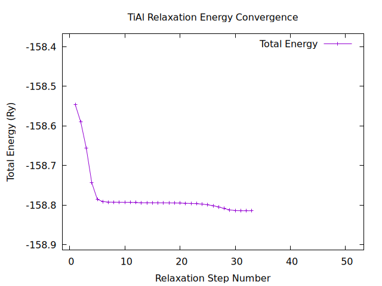

# Computational Analysis of γ-TiAl for High-Performance Applications

## 1. Project Overview

This repository contains the input and output files for a Density Functional Theory (DFT) analysis of gamma-Titanium Aluminide (γ-TiAl). This advanced intermetallic alloy is a key material for lightweight, high-temperature components in the **aerospace and performance automotive industries**, such as low-pressure turbine blades and engine valves.

The primary goal of this project was to determine the ground-state structural properties and total energy of the stable L1₀-ordered phase of γ-TiAl using first-principles calculations.

---

## 2. Methodology

The workflow for this project involved a combination of leading materials informatics databases and state-of-the-art simulation software.

### 2.1. Structure Identification

The initial crystal structure for the simulation was sourced from the **Materials Project**, a core platform of the **Materials Genome Initiative**. This database provides access to a vast number of computationally derived structures, including data from large-scale discovery efforts like the **Google DeepMind GNoME project**. The stable, ground-state L1₀ structure of γ-TiAl (`mp-1953`) was identified and used as the starting point for our calculations.

### 2.2. DFT Simulation

The simulation was performed using **Quantum Espresso v.7.3.1** within a WSL (Ubuntu) environment. Key aspects of the simulation include:
- **Calculation Type:** Full geometry and cell relaxation (`vc-relax`) to find the lowest-energy structure.
- **Convergence Techniques:** Metallic smearing (`methfessel-paxton`) was implemented to ensure accurate electronic convergence for this metallic system.
- **Analysis:** Key results, including the final total energy and relaxed lattice parameters, were extracted from the output files. The energy convergence was visualized using `gnuplot`.

---

## 3. Repository Contents

- **`gamma_TiAl.in`**: The final, corrected Quantum Espresso input file for the `vc-relax` calculation.
- **`gamma_TiAl.out`**: The final, complete output file from the successful simulation run.
- **`pseudopotentials/`**: This directory contains the UPF files used for Ti and Al.
- **`analysis/`**: Contains the data file and `gnuplot` script used for creating the convergence plot.
  - `energy_vs_step.dat`: The two-column data file of (step, energy).
  - `TiAl_convergence_plot.png`: The final visualization of energy convergence.

---

## 4. Final Converged Energy

The final ground-state total energy for the relaxed structure was calculated to be:
**-158.81405675 Ry**

